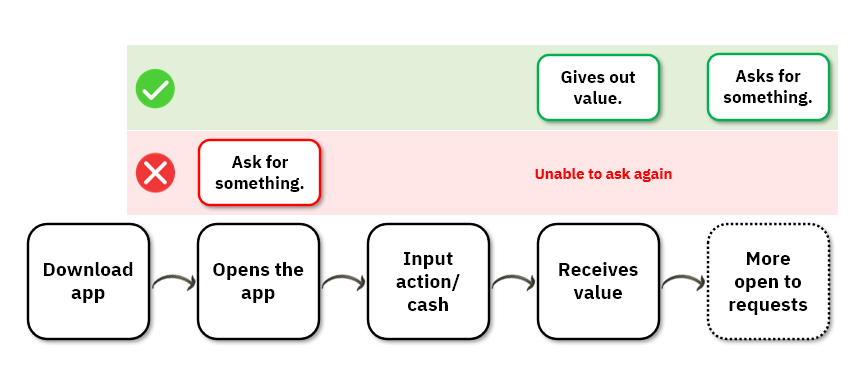
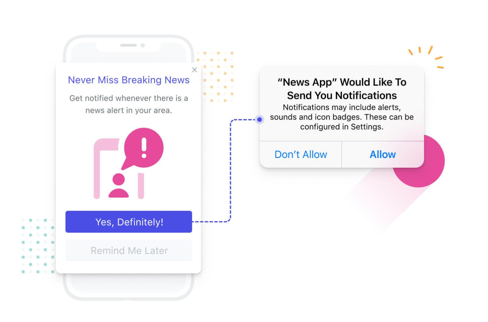
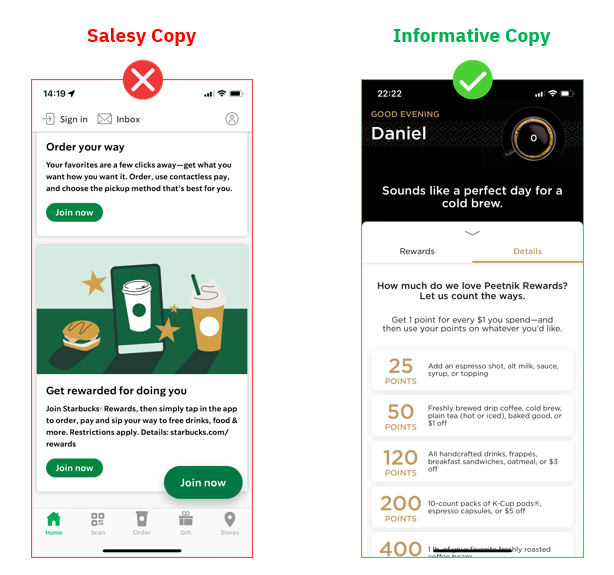
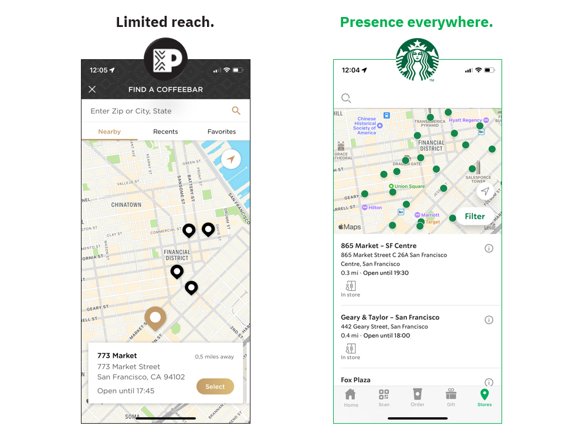

That Starbucks is a coffee shop powerhouse everybody knows. 
Living in California though, there are many options when searching for your daily caffeine dose.

One of those options is Berkeley-based Peet's Coffee, a west-coast focused chain with over 200 stores, most of them in the Golden State.

If there's no comparison in terms of company size (Starbucks has at least 12x Peet's units in California), those companies go head-to-head in terms of mobile experience: Peets Coffee has a 4.9 rating on Apple Store compared to Starbuck's 4.8.
From a superficial Job-to-be-done perspective, their digital product aims to help users with: 

● Ordering with less friction.  
● Giving them access to shop's rewards program.  

We will analyze each digital product mainly (but not exclusively) in light of those 2 angles.  

Which do you think is more likely to be better? Keep reading and draw your conclusions!   

To make it clear, their app is not a key aspect in the competition dynamics since Starbucks has incredible moats built over time, but in my opinion, it can be a relevant part of gaining relevance in some specific regional markets. 

I went as far as ordering a Coffee on both of them. I picked 2 units close to each other in San Francisco and ordered on the same day with a 10-minute difference.   

It's obvious that one store is not a big enough sample to use as a proxy for the whole chain, the goal here was just to get a glimpse of the ordering experience through the app.

To the case study!

<Slider/>

##### Key UX Takeaways

##### 1.  Consider push prompt timing and execution

Push notifications has been growing in relevance as a tactic part of retention and engagement strategies.
It was surprising to see Starbucks do this poorly. They send the user a push opt-in prompt (the one that asks the user if they want to receive notifications or not) as soon as they first open the app, this is problematic for two reasons:

**1.**  The user didn't receive any value from Starbucks yet, so the likelyhood of them accepting a request from the company is low.  
**2.**  On IOs (which is used by more than 50% of the US population), if the user clicks "Don't Allow", you can't prompt again unless the user reinstalls the app.  

To do this better:

Consider timing when setting up this flow: The Reciprocity Bias describes the impulse to reciprocate actions others have done towards us - this might be in play here: if I had gotten something from the app already, I would feel inclined to accept their request to sending me notifications.

Build a 2-step process: prompt the user through your app and if they accept it, allow the system's prompt to show up. By doing this you can avoid "impulse" rejections on the request, and also have the chance to prompt again later, once the user is better qualified.

This is important not only from Starbuck's conversion perspective but also to the UX: It's not a good experience to have to go back on the phone's settings once you notice you would like to receive notifications (but had rejected before because of timing).

There are some other best practices, but with only those two there could be significant gains on the effectiveness of the strategy and the for the user.

##### 2. Leverage copy to offer a better experience.

UX copy is often neglected on products, but for some specific customer's Jobs to be done, it should be seen as a fundamental part of the solution. 

On our case, participating/understanding a rewards program is a key aspect of the experience. When we compare how Starbucks and Peets use their product's real estate to describe their programs, we can see how great writing can be used to enhance the experience.

While Peets puts in an effort to make it crystal clear what's in it for the customer, Starbucks wastes a whole screen with highly "salesy" copy.

While building your product, consider how you can use copy as best as possible to make the user feel safe with your solution and sure about the next steps they will take.

##### 3. Experience beyond the digital scope

In my opinion, from a purely digital perspective Peet's app is better. UX goes beyond that tough.

Imagine you enjoy having coffee while you're at home, during work break and also while on a short weekend travel.

If you're relying on Peet's, you would be frequently disappointed since the company's presence is not as large. Starbucks has 2,400 stores only in California, whereas Peets has just over 230 units. 

This real-world infrastructure allows Starbucks to offer a better user experience: virtually wherever you are in California, you are unlikely to be disappointed when trying to find a store and buy your coffee.

The lesson here is to consider what other factors beyond the design of the product interferes on how good the User's Experience will be.

As an example, in a lot of SaaS niches companies rely heavily on Customer Service to offer a good experience. Others like Starbucks have real-world infrastructure as a key variable.

##### **Conclusion**

As I mentioned before, details on the digital experience might not be a huge factor on this battle because Starbucks is much larger.

Maybe that's not the case for the products we deal with in our careers, so being attentive to the customer is key.

It was interesting to see how a smaller chain puts relatively more care in delighting users through their digital product.

Thanks for reading!

