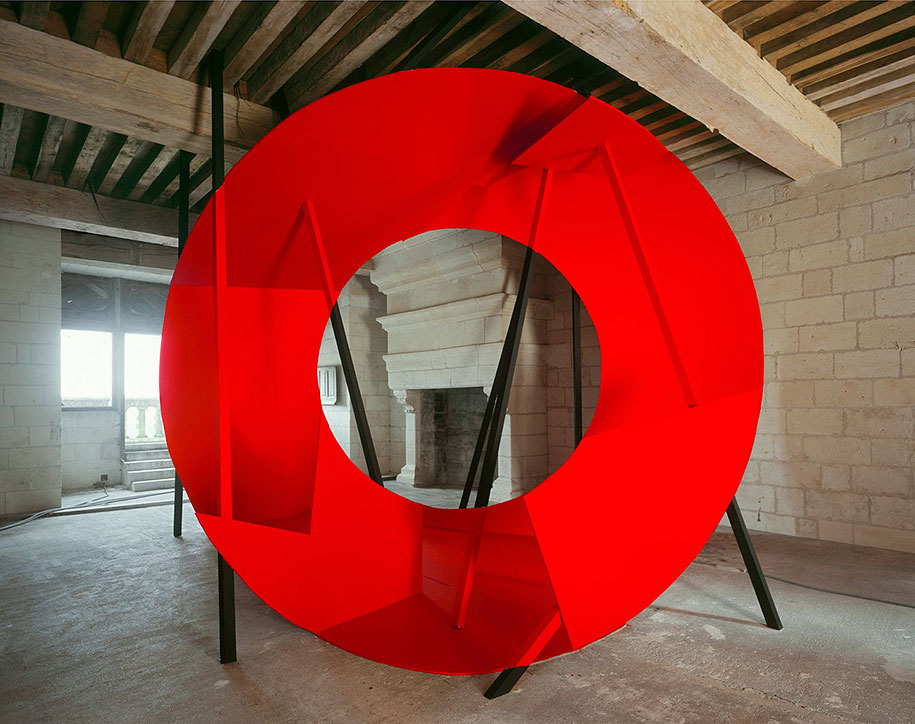
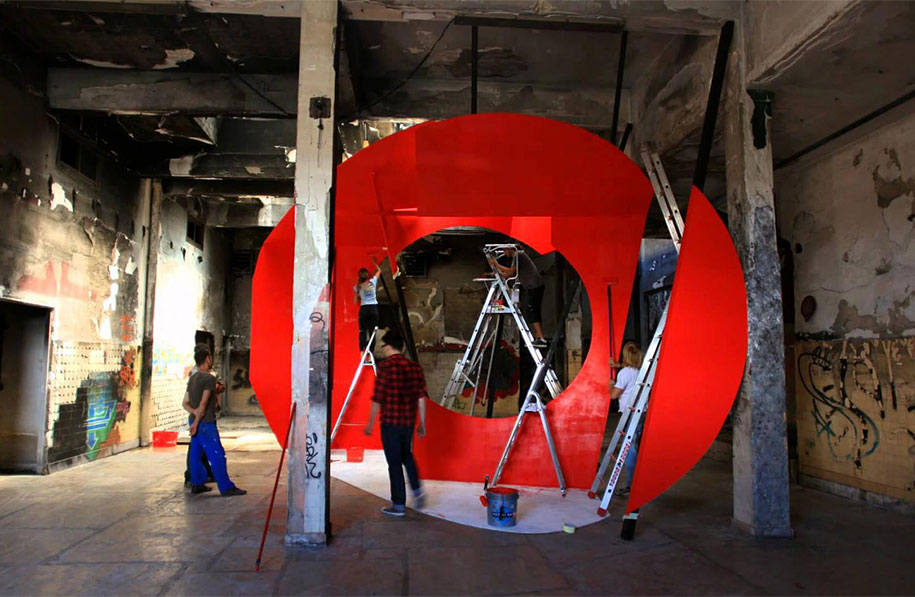

Georges Rousse’s work is a type of geometric art that is only visible from one angle. It is beautiful, mind-blowing even, but you can only see it if you look through the right perspective.  

If you look in any other way, it seems like total chaos:

In enjoying art, we can let ourselves be fooled by optical illusions — that might even be where the beauty lies.  

In business, we must seek to see the whole truth.

###### Looking widely at complex situations

I majored in economics, worked in finance, ran a small business and have been growing a deeper passion for product design and strategy. Knowing the basics of those disciplines, I can say they all matter a lot.  

Still, I feel a constant temptation to think about my obsession at each step of the journey as THE part that makes or breaks it all. 

Books on any one specific topic frequently make claims of being the single source of truth — “if you only get this right, your business is set”. It gets worse when the famous framework is provided, which formalizes and structures the claim.  

That couldn’t be further removed reality.  

Being married to a framework is a great way to fail because it gives us an illusion of control — things will look just fine, and it might serve as a pretext for our actions.  

Standing on a single perspective will prevent you from seeing the whole picture, which is exactly what we want. 

The business world is a complex system with multiple wide context problems. It’s impossible to solve wide context problems with narrow thinking. 

This [article](https://blog.tjcx.me/p/40k-fantastic-startup-idea?s=r) explains how an apparently great startup idea turned out to be a terrible business.  

Tom was a brilliant developer that had the awesome idea of building a platform that analyzed data to provide answers to common medical questions.  

From a purely “would it be good for people?” perspective, it seemed awesome. 

Done, right? You have something good for people, you have a business.  

Not really. 

There is a huge gap between doing something that would be good for people and doing something people want.  

There is an even bigger gap between things people want and things people would pay for.  

The article is worth reading, but my point here is that we need to enhance our perspective and not marry quotes/frameworks/theories or any other form of condensed knowledge.  

We are better off looking at wide situations widely. No business framework will ever stand alone.  

###### What, then?

Using frameworks is a great way to simplify any single business angle. But that speaks only to that specific side of reality.  

The important thing is to be able to understand the situation and the probable angles available enough that you effectively prioritize and go deeper on the right ones.  

There’s no need to know it all — cross-checking it with knowledgeable people from different domains goes a long way.  

Some information will only come to the surface once put to the test, which reinforces the importance of Silicon Valley’s culture of rapid experimentation.  
That doesn’t mean we can’t put in more effort to understand different perspectives beforehand. The classics on strategy, marketing, design, economics, behavioral economics and finance can give you a good baseline to at least know where to look for answers.  

###### The angle that feels like a fundamental truth

Recently, I’ve been obsessed with trying to understand what make particular products great and how the ideas for them came to be.  

Hindsight bias is obviously present in any analysis like that: luck, cultural aspects and a lot of testing were involved in the development of every great product.  

Even for those involved in the decision making at the time, it’s hard to explain objectively — humans tend to use rational arguments to explain decisions that weren’t necessarily made using logic.  

With that being said, most great builders consider customer experience the main part of creating great things.  

Jeff Bezos claims that “if you focus on the customer experience, everything else will follow”.  

Steve Jobs once said, “you have to start from the desired customer experience and work backwards to the technology”.

We shouldn’t misunderstand it as “you just have to look at the customer experience”. What they do in reality is use the customer experience as an anchor for their thought process and prioritization while also exploring other perspectives deeply.

You start from it, use it as a north-star, but don’t just stay there.  

In Working Backwards, the authors explain how Jeff and Amazon’s team built their process and culture around finding and executing innovative ideas. 

It has a lot of parts, but a key aspect is how they would look at people to pick who they wanted leading those initiatives:

“The original idea was to create a large number of small teams, each under a solid, multidisciplined, frontline manager and arranged collectively into a traditional, hierarchical org chart. The manager would be comfortable mentoring and diving deep in areas ranging from technical challenges to financial modeling and business performance. Although we did identify a few such brilliant managers, they turned out to be notoriously difficult to find in sufficient numbers, even at Amazon.”

In practice, they had to change the organizational structure to a matrix since well-rounded managers were hard to find.

I believe we should strive to be precisely that kind of person. Those that Amazon found hard to find.

Avoid being superficial and thinking narrowly. Go deep on the right things.

Imagine Georges’ art whenever you use a framework. Ask yourself: what am I not looking at that might be important?

One thing I’m sure of: to be able to effectively stand at different angles, we have to read a lot. The more we’re exposed to, the better we will be in reconciling it all.

Ourselves and the world will be better off if we do.

Thanks for reading!

