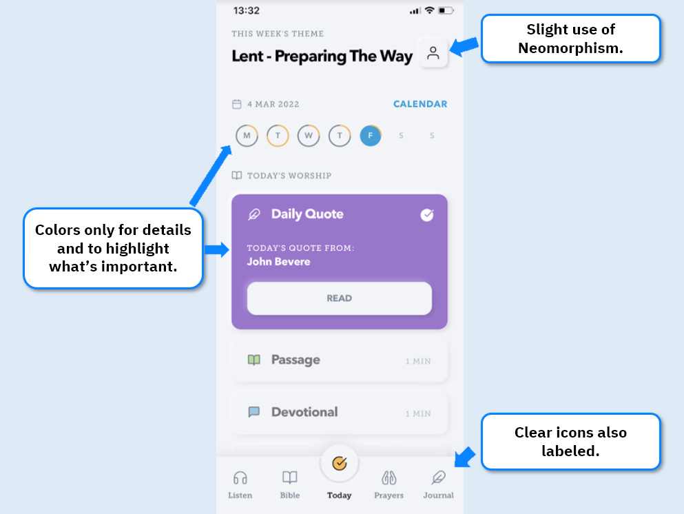
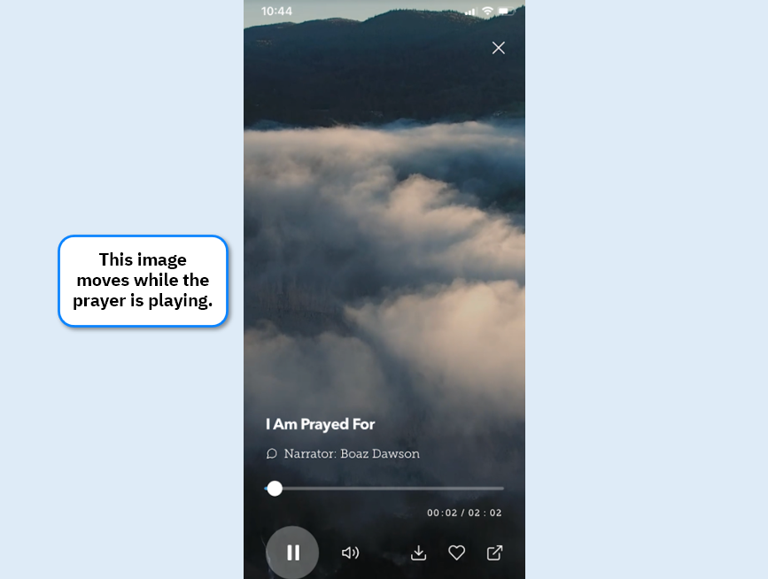
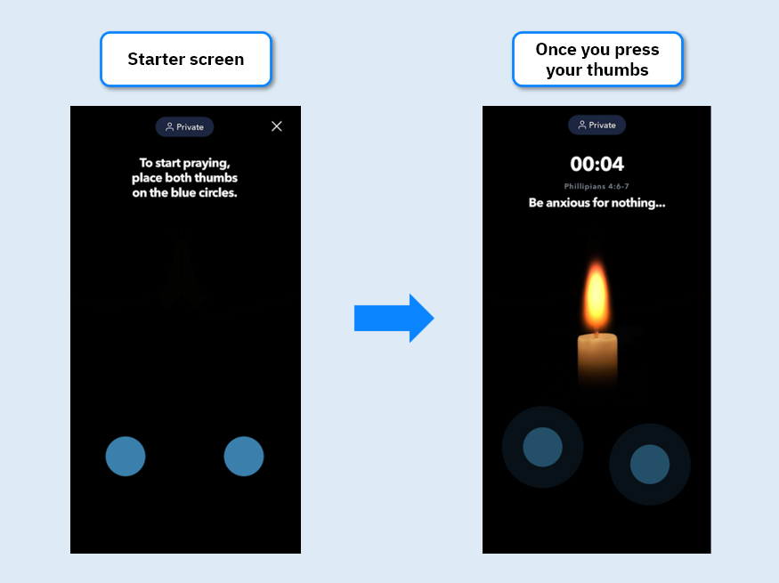

Glorify is an app that helps Christians practice their faith and connect digitally. In 2021 they raised more than $42mm, mainly from behemoth VCs a16z and Softbank, as well as Hollywood stars such as Jason Derulo and Michael Bublé. That’s a remarkable round for a company with less than 2 years of operation.

Although not religious myself, the app sparked my curiosity and I started exploring to understand how they achieved such success. Christianity is the largest religion in the world with 2.5bn people. Surprisingly, practicing it hasn’t gone online the same way other aspect of our lives did. Looking at those numbers, it’s hard to believe that Glorify ‘competes’ with online communities managed by non-profits, Facebook groups and in-person gatherings. There’s no other digital and organized player. Apps such as the Holy Bible have huge amounts of downloads but limited functionality. 

Glorify is going one step beyond other offerings, trying to build a complete online infrastructure for Christians to exercise their faith and develop daily worship habits. To succeed, a great user experience is fundamental: they have to imitate the feeling of real community, connection and real worship that it all entails.  
<h5> Overall, Glorify is a great product, but there are some points to watch on the user User Experience: </h5>

<Slider/>

##### For a more structured look, read the article!

##### 1.  A habit-forming product

To be on top of their category, a product must effectively fulfill user’s needs. In this case, users want help in developing a daily worship habit. Glorify is designed to foster that.
Their main feature seems to be the Today screen: each week has a theme, and around this theme they offer daily content of 4 types:

**1.**  Daily quote, that you start having already completed it, giving an instant feeling of progress;  
**2.**  A passage of the bible;  
**3.**  A “devotional”, which is an interpretation of the passage you’ve just seen;  
**4.**  A reflection on that passage, going a little deeper.

Once you finish all 4, a stretch goal is unlocked, showing you more content related to the week’s theme. Every aspect of this screen seems to be built for the user to come back everyday:

● You are rewarded just by opening the app since the entry screen is their “Daily Quote”, so it will be already checked when you see the page.  
● Tasks that are short to complete (1 to 3min).  
● Progress feedback is immediate - seeing the calendar fill up and the items being checked.  
● You get an additional reward (other than the streak) after completing all 4’s - a stretch goal opens, with different content.

The Hook model is one of the most known product building frameworks. If we analyze this page through that lens, here’s what we get:

Glorify follows it almost to the letter, I believe it was designed with that framework in mind. It is likely this design is a driver of a lot of their retention.

##### 2. Delighting through details.

Glorify’s stated mission is to help in creating a Worship habit, which in turn makes people feel good (in their words, “connected to god”). The state of the app needs to reflect the state they aspire to lead the user towards. This is a common theme on all of the best wellness software: think about how much praise Headspace’s gets on their color palette, illustrations and overall design. 

Although not sufficient for success, having an aesthetically pleasing and easy to understand design is a permission to enter the game, and in that aspect Glorify nails it. It adds to the app’s functionality. In this case, the UI is seems to be carefully thought out to be easily navigated and processed, but they don’t limit themselves to that.

Easily identifiable icons with labels, clear/familiar font style and color choices that highlight the most important things makes navigation and understanding of the app easy. Their use of neomorphism is not overwhelming and makes it easy to identify buttons. On top of showing craftmanship through their main functionality, Glorify also puts an effort in creating small special moments of delight. 2 examples captured my attention:

***Listening screen:***  

This has a slight movement, as if you were moving forward on the sky. Small detail, but those add up.

***Prayers UI:***
One of their features let you record a prayer. Here’s the design:

Once you put your fingers on the blue circles, a candle shows up, making it look like you’re holding a candle.

This was one of the most creative pieces of UI I’ve ever seen. Although I’m not sure how much people are willing to use this alone, it might be useful to group situations. All-in-all, it is just really creative and I was happy to see this. 

##### 3. **Exclusive Content is King**

While the app has more than just a “consume content” functionality, in the long-run having exclusive content is fundamental to the user’s experience. Not only that, it is an strategic asset in defending against possible competitors: it is possible to structure an app in a similar way, but what you put behind each tab is harder to copy. 

Slowly but surely, Glorify is building a vast library of original content around Christianity. An example: they offer music as content, which I at first I thought was expendable considering Spotify exists. Looking further, I realized there are more than 120 tracks recorded specifically for the app. 

They also offer more than 30 different prayers and longer form videos with experts talking about specific topics such as the relationship between Physiology and Theology. 

##### **Conclusion**

**1.**  Consider using the Hook Model when designing, and you can create a product that users are compelled to frequently come back; 

**2.**  Aesthetics alone doesn’t make a good product, but it can take a good product to another level;

**3.**  Think long-term and start building unique experiences (in this case, content) since day one. 

Glorify is a great product in a huge market, so I expect them to reach something close to Calm app’s current size. 

Although the design is overall great, there are some points I would change to make it better. I made a more complete product breakdown on my blog, feel free to check it out!

Thanks for reading!

This case study was inspired by @PeteRamsey's work at https://builtformars.com/.

