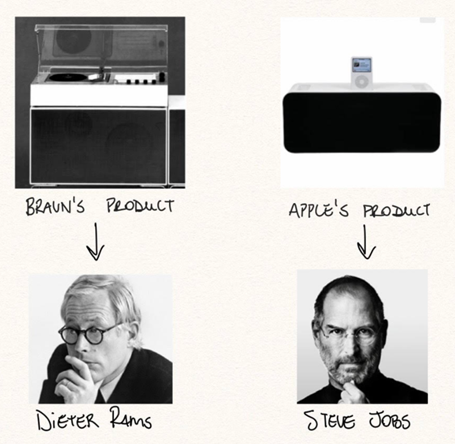

I remember writing comic books and drawing for hours as a kid — creating was as part of life as eating or showering, sometimes even more so.

My first “job” was at 15, building digital scenarios for an alternative server of an online RPG I used to play — I loved it.

Although it lasted 2 months and my income was around $50, I wonder how creativity was a huge part of my identity growing up, and how it lost importance as the years went by.

Between the final years of high school, majoring in Economics and working in Investment Banking, saying creativity was suppressed in my life is an understatement.

My focus was 100% in memorizing formulas and learning tools, shaping myself to what I thought was necessary to succeed in Finance.

I have recently quit banking, helped in a family business and moved from Sao Paulo to SF. In that context, with new goals, Creativity is gaining relevance and I see it more and more as a powerful skill to master and leverage.

By reading books and diving deeper, I’ve been trying to understand how it works and what can we do to get better.

My starting point was one of confusion: on one hand, the perspective of it being a born characteristic that some have, some don’t. On the other, I remembered how I used to be creative and even gained my first bucks leveraging it.

Could we lose it completely? Is it a muscle? Could I get it back?
For my excitement, most researchers and even artists see it as “a creative process” — something you can learn and apply — instead of an abstract incomprehensible ability.

There are lots of mental models that help with that process but going from knowing to shipping might be a challenge.

One of the challenges in the way of the artist is the originality myth.
Creators, especially beginners, want to find ideas that are completely unique, 100% original. That, as history shows us, is impossible.

Darwin and Russel Wallace discovered evolution at the same time but independently.

Einstein and 3 other physicists came up the relativity concept in a 6-year window, although Einstein’s interpretation was deeper and the only 100% correct.

The list of multiple discoveries is long. We can’t discredit the genius: it takes inhuman brains and work ethics to be at the forefront of a field for years, and a lot of courage to move it forward.

But there is something us mortals can take from all that.

Even what we consider the purest of ideas rely heavily on mixing concepts available at the time, on “standing the shoulder of giants”.

This quote by Wilson Mizner, a famous American playwright, puts it well:

If you steal from one author it’s plagiarism. If you steal from many it’s research.

That should give us some permission to dive into other people’s work and let ourselves be influenced.

This reflection made me think about how it plays out in business, as the originality ideal is as big in entrepreneurship as it is in arts.

The image of innovation in the Valley is Steve Jobs. Among lots of skills, he was a master at applying his diverse influences into products.

Apple grew following simplicity and minimalism inspired by Zen and the Bauhaus (a famous architectural movement), both key influences in Steve’s design taste.

Before him, Dieter Rams, another designer of personal electronics, had also relied on those principles to his craft. He worked for Braun, a German consumer products company, and grew quickly at his job by following an Apple-like design philosophy.

Just 20 years before Apple came up with it.

One of Rams’ key principles is “good design is as little design as possible”. Sounds like someone we know?

It took a genius to see the potential of the touch screen, apply simplicity to an extreme and get rid of the long-living keyboard and put together “an iPod, a phone and an internet communicator” — between many other things that he gave us.

That doesn’t mean it came out of nowhere.

In more extreme cases, some businesses use an outright copy/paste strategy: same product, different countries/brands. On the last 12 months 2 startups copying the American Thras.io started to operate in Latin America and Europe.

The proposal is to acquire businesses that run through Amazon marketplace (digitally native brands mostly) — Thras.io does that since 2018. Both young companies received up to $200mm in venture capital.

That is not unknown in the business world: Rocket Internet made its owners billionaires by looking at successful businesses in the US and copying them in other parts of the world. 

They now employ 25,000 people in over 100 countries
Researching the topic I came across an HBR interview with Oded Shenkar, a professor that researched the value of imitation and found out that 97.8% of the value of innovations goes to imitators. 

Shenkar explains how applying imitation is a process that requires high intelligence and is “what enabled the great apes to survive in a hostile environment despite significant physical shortcomings”.

History has shown us that not only originality is a myth, but unnecessary in creating valuable things. That should give us permission to go deep into the work of others.

I agree that 100% copying might feel boring (and can even be a crime, depending on the situation), but we can take a lot from intentionally using the greats as inspiration. In “Steal Like an Artist”, Austin Kleon says it best:

“Copy the reasoning behind the styles — you don’t want to be seen like your heroes; you want to see like they do”.

Go for it. Copy, transform, combine. Maybe you’ll be the next person to mix a Zen Garden, German house appliances and an architectural movement to create a revolution.

Thank you for reading and follow me on Twitter! 