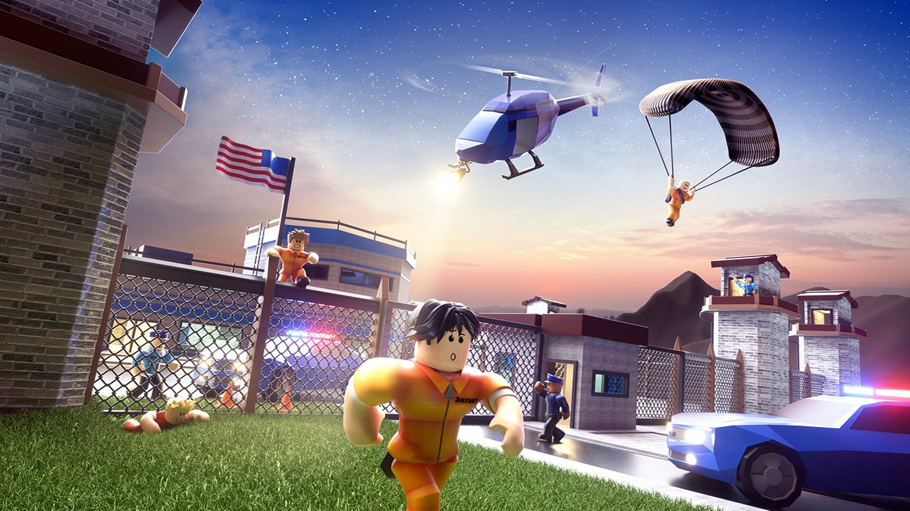
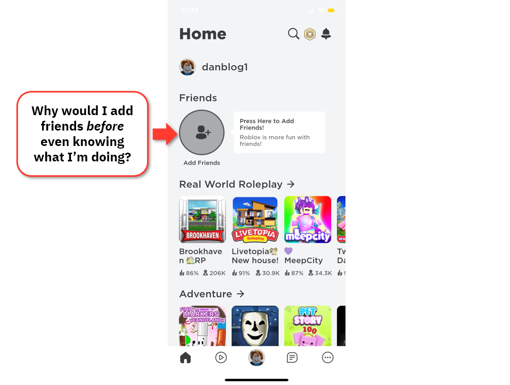
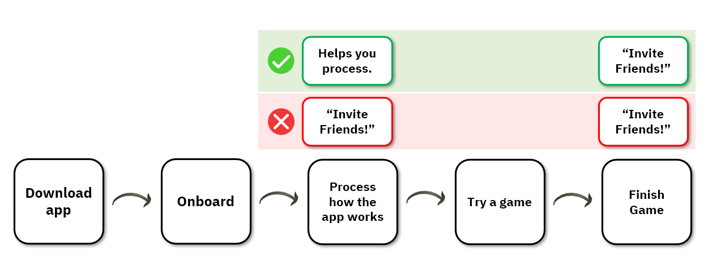
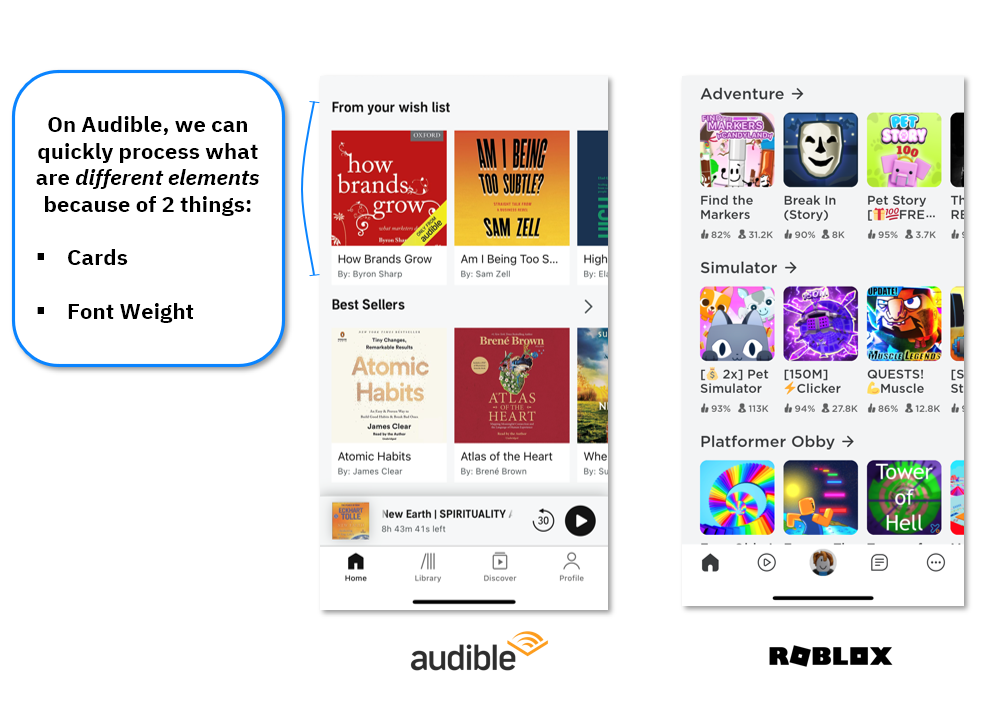
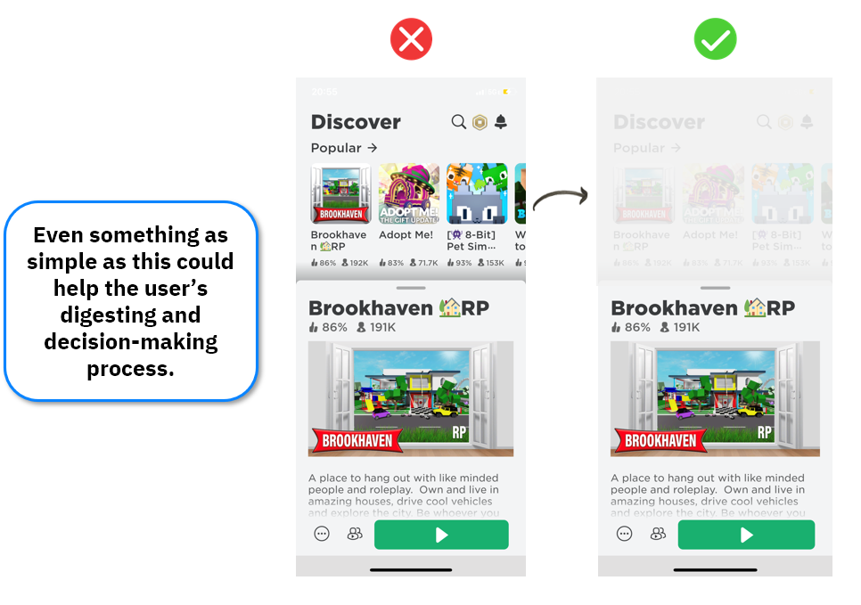
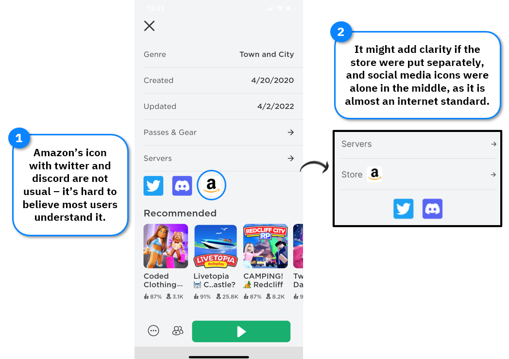

Roblox has gained a lot of attention recently with the raise of the concept of Metaverse to the *zeitgeist.* 

According to their public fillings, they are a platform where people can *“play, learn, communicate, explore, and expand their friendships, all in 3D digital worlds that are entirely user-generated, built by our community of nearly 7 million active developers”.*

The company is currently valued at $30bn dollars, driven by a total of 230 million players. 

Historically, it has been used mainly by kids to play with their friends. 

Recently tough, Roblox has been eyeing older age demographics: according to Craig Donato, the company’s Chief Business Officer, their *“goal is to create a platform and brand that appeals to all ages".*

With that, a lot of design challenges will come - building focused on the gaming experience of kids is different from creating a complete experience for adults. 

It’s true that the company’s strategy was historically anchored around their gaming experience and building capabilities that enabled developers to do their jobs. 

Now, with different goals on the horizon, Roblox must start paying attention to other aspects of its product.  

From the point of view of a new user through an iOS device, Roblox’s UX is still pretty rough. 

To understand how big of a challenge they’ll have in trying to be the platform that drives mass adoption of the Metaverse, read on!

<Slider/>  

##### ⬇️ **Here are the key takeaways on Roblox's UX:** 

##### 🛣️  **Consider the context, understand where the user is in the journey**

Each user is in a different part on their journey - some are power users already while others are just  trying out to see if they will like the experience. 

More often than not builders ignore those possible contexts, making it harder for some users to seamlessly go from action to action. 

In the case of Roblox’s first steps on the user journey, that context is not given any consideration. 

The user is shown the home screen with a button to add friends as the most prominent element, and worlds you can choose on the bottom.

I don’t even know how Roblox works, why would I invite a friend? 

This “bad” experience might be irrelevant to kids that have been playing it for a while but building it to a broad audience means considering that others might not have as much context as their initial customer base did.

This is the first thing that appears once the user finishes creating an account:

Products should be designed considering where the user is in their journey. Showing “Add a Friend” prominently wouldn’t be as much of a problem if the page were better organized in terms of space and information, but that’s not the case here. 

This is specifically weird since games are usually known for their thoughtful guidance for new users.

##### 🎨  **Leverage formatting to make decision-making easy**

Giving context is a big part of helping users decide which steps they want to take next, but there are more ways to help. 

Formatting and positioning of elements are important parts of usability - it gives hints on what’s important and what next steps the user should take.

Colors and formatting are not just ways to make an application pretty, it is a signaling device, a tool to make processing of information easier.

In the case of Roblox the main page is noisy, and they make almost no use of different colors or proper spacing. If we compare it to Audible, for example, we can see that font weight and cards were used to differentiate the elements and make the understanding of a page’s structure easier.

Roblox could also leverage formatting once you click on a world to play. 

With a simple design change, the most important part of the page - the user’s likely next step - would be prominent, and they would still be able to go back to the home page if needed.

##### 🧠  **Consider people’s mental models**

People try to understand a system based on mental models. According to the Nielsen & Norman Group, a mental model is the set of **believes an user has** about the system at hand. 

Those mental models are built based on learning, mainly through past experiences. When designing, it’s important to **make the system conform** to users' mental models. 

In this case, Roblox added confusion by mixing things that usually go together with an element that is somewhat an outlier. 

Separating those and following almost universal internet standards would add clarity to the experience.

It’s likely that Roblox didn’t pay attention to those aspects because of their single-minded focus on developing the foundations of a platform that is surely technically complex.

That way of allocating resources might make sense for their past strategic goals. In the current context though, when aiming towards wider adoption, it might be important for the company to go deeper on those underdeveloped aspects of their User Experience.

Thanks for reading!

